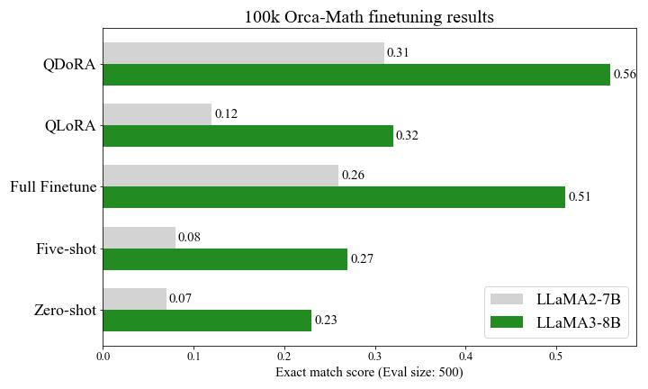

# QDoRA + FSDP
Here are the steps to reproduce the results reported in the Efficient finetuning of Llama 3 with [FSDP QDoRA](https://www.answer.ai/posts/2024-04-26-fsdp-qdora-llama3.html) blog post.

<h1 align="center"> 
    
</h1>

## Setup
```Shell
conda create -n qdora python=3.10 -y
conda activate qdora
pip install llama-recipes fastcore "transformers!=4.38.*,!=4.39.*" --extra-index-url https://download.pytorch.org/whl/test/cu121 #replace 121 with your desired Cuda version
pip install bitsandbytes>=0.43.0
git clone https://github.com/AnswerDotAI/fsdp_qlora
```

## LLaMA-2/3 Access (optional)
Request for access to the LLaMA-2/3 model on Hugging Face., then do
```Shell
huggingface-cli login
```

## Finetuning LLaMA-2/3 on the Orca-Math dataset

### LLaMA-2 training scripts
```Shell
## QDoRA
python train.py \
--train_type bnb_dora \
--model_name meta-llama/Llama-2-7b-hf \
--dataset orca_math \
--dataset_samples 100000 \
--batch_size 4 \
--context_length 2048 \
--gradient_accumulation_steps 2 \
--sharding_strategy full_shard \
--use_gradient_checkpointing true \
--reentrant_checkpointing true \
--use_cpu_offload false \
--use_activation_cpu_offload false \
--log_to stdout \
--project_name "fsdp-quantized-dora-exps" \
--save_model true \
--output_dir fsdp_qlora/models/llama2-7b-orca-math-100k-QDoRA
## QLoRA
python train.py \
--train_type qlora \
--model_name meta-llama/Llama-2-7b-hf \
--dataset orca_math \
--dataset_samples 100000 \
--batch_size 4 \
--context_length 2048 \
--gradient_accumulation_steps 2 \
--sharding_strategy full_shard \
--use_gradient_checkpointing true \
--reentrant_checkpointing true \
--use_cpu_offload false \
--use_activation_cpu_offload false \
--log_to stdout \
--project_name "fsdp-quantized-lora-exps" \
--save_model true \
--output_dir fsdp_qlora/models/llama2-7b-orca-math-100k-QLoRA
```

### LLaMA-3 training scripts
```Shell
## QDoRA
python train.py \
--train_type bnb_dora \
--model_name meta-llama/Meta-Llama-3-8B \
--dataset orca_math \
--dataset_samples 100000 \
--batch_size 4 \
--context_length 2048 \
--gradient_accumulation_steps 1 \
--sharding_strategy full_shard \
--use_gradient_checkpointing true \
--reentrant_checkpointing true \
--use_cpu_offload false \
--use_activation_cpu_offload false \
--verbose true \
--log_to stdout \
--project_name "fsdp-quantized-dora-exps" \
--save_model true \
--output_dir fsdp_qlora/models/llama3-8b-orca-math-100k-QDoRA
## QLoRA
python train.py \
--train_type qlora \
--model_name meta-llama/Meta-Llama-3-8B \
--dataset orca_math \
--dataset_samples 100000 \
--batch_size 4 \
--context_length 2048 \
--gradient_accumulation_steps 1 \
--sharding_strategy full_shard \
--use_gradient_checkpointing true \
--reentrant_checkpointing true \
--use_cpu_offload false \
--use_activation_cpu_offload false \
--verbose true \
--log_to stdout \
--project_name "fsdp-quantized-lora-exps" \
--save_model true \
--output_dir fsdp_qlora/models/llama3-8b-orca-math-100k-QLoRA
```

## Evaluation
500 samples are reserved for evaluation using the exact match score as the metric.
### Download the eval_utils.py and evaluate.py
```Shell
cd fsdp_qlora
wget https://github.com/AnswerDotAI/fsdp_qlora/blob/e454d3180ef575654279d6ac444a86cb0bb3ff33/eval_utils.py
wget https://github.com/AnswerDotAI/fsdp_qlora/blob/e454d3180ef575654279d6ac444a86cb0bb3ff33/evaluate.py
```
### LLaMA-2 evaluation scripts (replace --trained_model_dir with the address of your DoRA/LoRA weights)
```Shell
## QDoRA
python evaluate.py \
--eval_type bnb_dora \
--model_name meta-llama/Llama-2-7b-hf \
--models_dir /workspace/quantized-lora-models/ \
--trained_model_dir fsdp_qlora/models/llama2-7b-orca-math-100k-QDoRA \
--save_path fsdp_qlora/eval_results/100k-qdora.json
## QLoRA
python evaluate.py \
--eval_type qlora \
--model_name meta-llama/Llama-2-7b-hf \
--models_dir /workspace/quantized-lora-models/ \
--trained_model_dir fsdp_qlora/models/llama2-7b-orca-math-100k-QLoRA \
--save_path fsdp_qlora/eval_results/100k-qlora.json
```
### LLaMA-3 evaluation scripts (replace --trained_model_dir with the address of your DoRA/LoRA weights)
```Shell
## QDoRA
python evaluate.py \
--eval_type bnb_dora \
--model_name meta-llama/Meta-Llama-3-8B \
--models_dir /workspace/quantized-lora-models/ \
--trained_model_dir fsdp_qlora/models/llama3-8b-orca-math-100k-QDoRA \
--save_path fsdp_qlora/eval_results/100k-qdora.json
## QLoRA
python evaluate.py \
--eval_type qlora \
--model_name meta-llama/Meta-Llama-3-8B \
--models_dir /workspace/quantized-lora-models/ \
--trained_model_dir fsdp_qlora/models/llama3-8b-orca-math-100k-QLoRA \
--save_path fsdp_qlora/eval_results/100k-qlora.json
```
